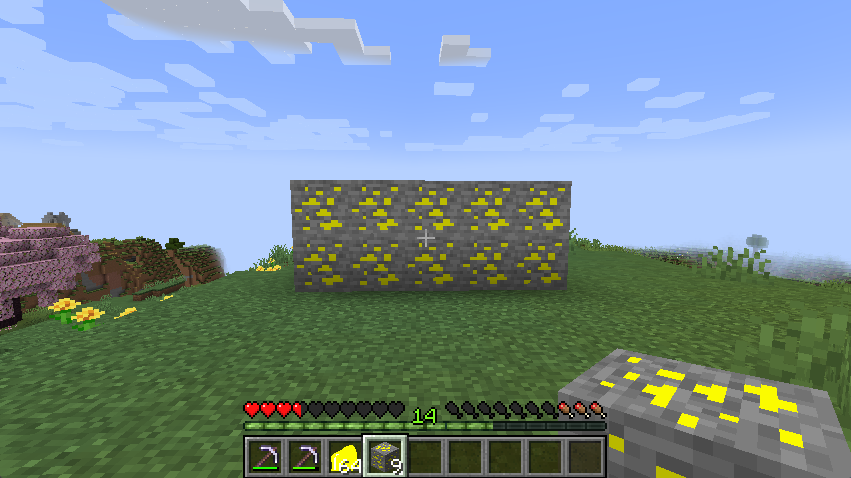
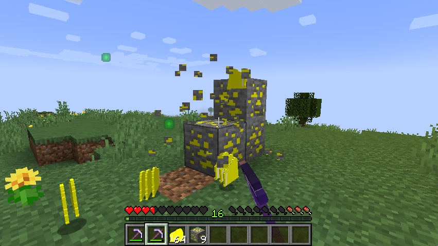
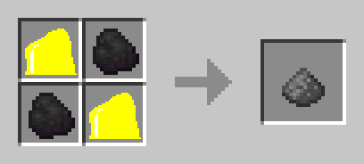
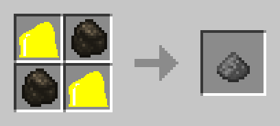

# MC-SulfurOreMod
```java
/**
 * Hello. Thank you for watching my Repository!!
 * @author Jp_ryos
 * @twitter @Jp_ryos
 * 
 * @forge Forge 47.1.44
 * @minecraft Minecraft 1.20.1
 */
```
## Features  
- New ore "**sulfur ore**" added



- If you dig with a pickaxe that does not have a silk touch, you will get "**sulfur powder**"!



- We can make "**gunpowder**" from "**coal(charcoal)**" and "**sulfur powder**" as shown in the image below.



## TODO
- ~~Add Json file for ore generation~~ **🔨Done**
- Maybe I should skin the "**sulfur powder**" a little better...?